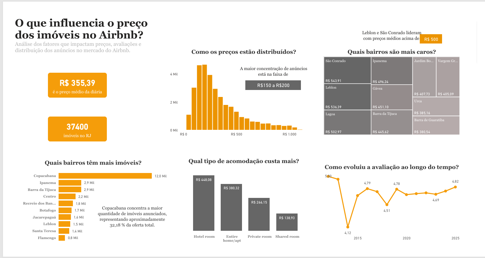

# Análise de Dados do Airbnb - Rio de Janeiro

## Contexto do Projeto
O Airbnb é uma plataforma global de aluguel de hospedagens por temporada que conecta 
anfitriões e viajantes em mais de 190 países. O Rio de Janeiro, com seu forte apelo 
turístico, é um dos mercados mais ativos do Brasil, com uma diversidade de bairros 
que cria um mercado amplo e heterogêneo, com perfis de preço e demanda bastante distintos.

Este projeto tem como objetivo analisar os dados do Airbnb no Rio de Janeiro, buscando 
entender o comportamento do mercado de hospedagens na cidade. Por meio de uma análise 
exploratória, foram investigados aspectos como distribuição de preços, tipos de acomodação, 
bairros com maior oferta e perfil dos anfitriões.

## Fonte dos Dados
Os dados utilizados neste projeto foram obtidos através do [Inside Airbnb](http://insideairbnb.com/), 
uma plataforma que disponibiliza dados públicos sobre listagens do Airbnb em diversas 
cidades do mundo. O dataset utilizado contém informações sobre os imóveis anunciados 
no Rio de Janeiro no período de 2025.

## 🛠️ Tecnologias Utilizadas
- Python (Pandas, NumPy, Matplotlib, Seaborn)
- Google Colab
- Power BI

## Análise Exploratória (Python)
A análise exploratória foi realizada no Google Colab e contemplou as seguintes etapas:

- **Visão Geral dos Dados**: estrutura, tipos de variáveis e valores ausentes
- **Análise Estatística**: medidas de tendência central e dispersão
- **Análise de Outliers**: identificação de valores extremos via método IQR
- **Limpeza dos Dados**: remoção de colunas nulas, tratamento de valores ausentes e remoção de outliers
- **Análise Exploratória**: resposta às principais perguntas de negócio por meio de visualizações

### Decisões de Limpeza
- Removidas as colunas `neighbourhood_group` e `license` por conterem apenas valores ausentes
- Outliers removidos nas variáveis `price` (limite R$ 1.109,50) e `minimum_nights` (limite 6 noites)
- A variável `price` apresentou 10% de valores ausentes concentrados nos bairros mais nobres, caracterizando padrão MNAR — optou-se por manter os registros para evitar viés na análise

## Dashboard
O dashboard foi desenvolvido no Power BI com o objetivo de apresentar os principais 
insights do mercado de hospedagens do Airbnb no Rio de Janeiro de forma visual e interativa.

### Indicadores Monitorados
- Preço médio da diária
- Total de imóveis

### Visualizações
- Distribuição dos preços dos imóveis
- Top 10 bairros com mais imóveis
- Top 10 bairros por preço médio 
- Preço médio por tipo de acomodação
- Evolução da avaliação média ao longo do tempo

## Principais Insights
- Copacabana concentra 32% dos imóveis, porém a alta competição pressiona os preços para baixo na região
- Hotel room tem o maior preço médio (R$ 448), mas representa menos de 1% dos imóveis
- A maioria dos imóveis está concentrada na faixa de R$ 150 a R$ 200
- Leblon e São Conrado lideram o ranking de bairros mais caros, com preços acima de R$ 500
- As avaliações iniciaram em 5,0 em 2012, caíram para 4,12 em 2014 e se recuperaram para 4,82 em 2025
- O preço não apresenta correlação forte com nenhuma variável, indicando que fatores como localização e qualidade do imóvel são determinantes no valor cobrado

## Conclusão
A análise dos dados do Airbnb no Rio de Janeiro revelou um mercado amplo e heterogêneo, 
com forte concentração de oferta em Copacabana e preços mais elevados na zona sul da cidade. 
A taxa de ocupação média de 50,64% e a avaliação média de 4,81 indicam um mercado 
maduro e com boa aceitação pelos hóspedes.

Entre os principais desafios identificados, destaca-se a ausência de correlação entre 
preço e avaliações, sugerindo que outros fatores não disponíveis no dataset — como 
qualidade das fotos, descrição do imóvel e localização específica — são determinantes 
para o desempenho de um anúncio na plataforma.
